## Задача
Чи може користувач запускати скрипт, не маючи на нього прав виконання? 
### *Реазілація*
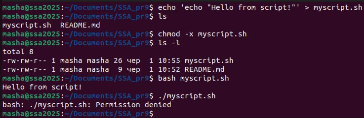
_______

## Задача 1

### Текст завдання
 Напишіть програму, яка читає файл /etc/passwd за допомогою команди getent passwd, щоб дізнатись, які облікові записи визначені на вашому комп’ютері.
 Програма повинна визначити, чи є серед них звичайні користувачі (ідентифікатори UID повинні бути більші за 500 або 1000, залежно від вашого дистрибутива), окрім вас.
### *Реазілація*
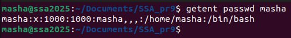

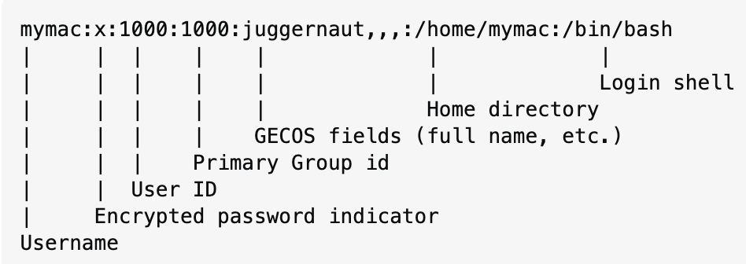

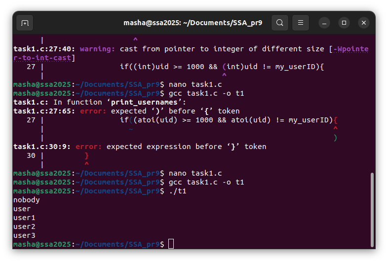

командою getent passwd отримуємо облікові записи, дістаємо юзернейми та айдішники, за якими потім фільтруємо та виводимо юзернейми
_______

## Задача 2

### Текст завдання
 Напишіть програму, яка виконує команду cat /etc/shadow від імені адміністратора, хоча запускається від звичайного користувача.
 (Ваша програма повинна робити необхідне, виходячи з того, що конфігурація системи дозволяє отримувати адміністративний доступ за допомогою відповідної команди.)
 
### *Реазілація*
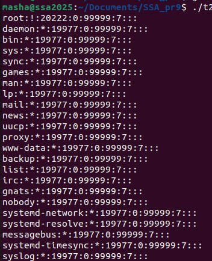

Файл /etc/shadow містить один запис на рядок, кожен з яких представляє обліковий запис користувача.

```
masha:$6$.n.:17736:0:99999:7:::
[--] [----] [---] - [---] ----
|      |      |   |   |   |||+-----------> 9. Unused
|      |      |   |   |   ||+------------> 8. Expiration date
|      |      |   |   |   |+-------------> 7. Inactivity period
|      |      |   |   |   +--------------> 6. Warning period
|      |      |   |   +------------------> 5. Maximum password age
|      |      |   +----------------------> 4. Minimum password age
|      |      +--------------------------> 3. Last password change
|      +---------------------------------> 2. Encrypted Password
+----------------------------------------> 1. Username
```

Командою *sudo cat /etc/shadow* отримуємо цю інформацію та виводимо кожний рядок поки вони не закінчаться.
_______

## Задача 3

### Текст завдання
 Напишіть програму, яка від імені root копіює файл, який вона перед цим створила від імені звичайного користувача. Потім вона повинна помістити копію у домашній каталог звичайного користувача.
 Далі, використовуючи звичайний обліковий запис, програма намагається змінити файл і зберегти зміни. Що відбудеться?
 Після цього програма намагається видалити цей файл за допомогою команди rm. Що відбудеться?

 
### *Реазілація*
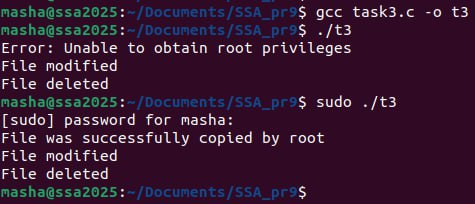

Бачимо, що програма запускається тільки від прав адміністратора, бо в коді виконуються операції, які зазвичай обмежені для звичайних користувачів
_______

## Задача 4

### Текст завдання
 Напишіть програму, яка по черзі виконує команди whoami та id, щоб перевірити стан облікового запису користувача, від імені якого вона запущена.
 Є ймовірність, що команда id виведе список різних груп, до яких ви належите. Програма повинна це продемонструвати.
 
### *Реазілація*
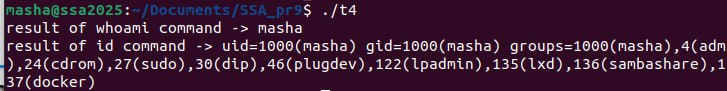


Командами  *whoami* i *id* отримуємо username та додаткову інформацію відповідно та виводимо.
_______

## Задача 5

### Текст завдання
 Напишіть програму, яка створює тимчасовий файл від імені звичайного користувача. Потім від імені суперкористувача використовує команди chown і chmod, щоб змінити тип володіння та права доступу.
 Програма повинна визначити, в яких випадках вона може виконувати читання та запис файлу, використовуючи свій обліковий запис.

 
### *Реазілація*
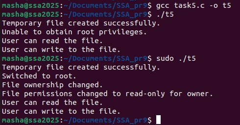

Програма демонструє, як зміна прав доступу та власності файлу впливає на можливість його редагування та видалення. Звичайний користувач може створити файл, але його права можуть бути обмежені адміністратором, що впливає на подальші дії.
_______

## Задача 6

### Текст завдання
 Напишіть програму, яка виконує команду ls -l, щоб переглянути власника і права доступу до файлів у своєму домашньому каталозі, в /usr/bin та в /etc.
 Продемонструйте, як ваша програма намагається обійти різні власники та права доступу користувачів, а також здійснює спроби читання, запису та виконання цих файлів.
 
### *Реазілація*
>$./t6
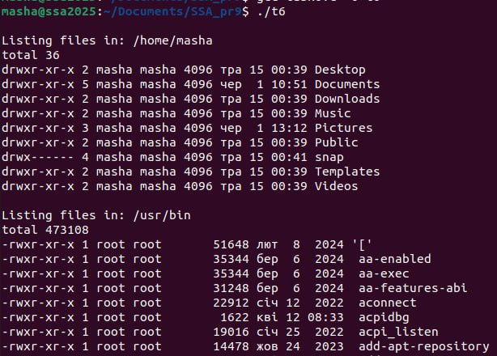

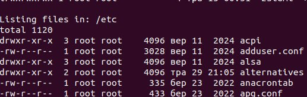

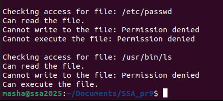

>$sudo ./t6

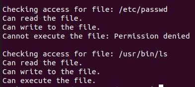

Програма виконує команду ls -l, щоб переглянути права доступу та власника файлів у $HOME, /usr/bin та /etc. Вона також перевіряє, чи може поточний користувач читати, змінювати або виконувати файли, використовуючи функцію access(). В результаті видно, що доступ до файлів залежить від їхніх прав і власника, а деякі дії можуть бути обмежені для звичайного користувача.
_______

